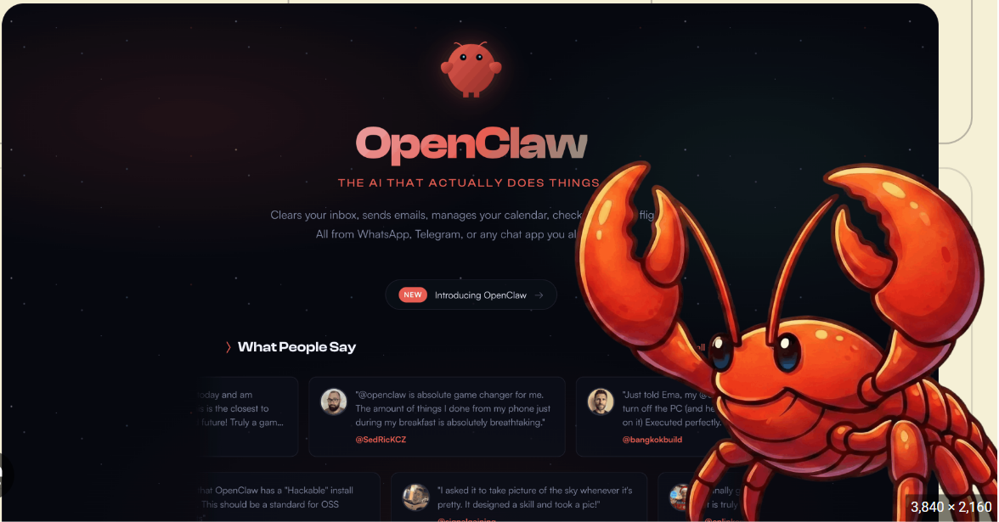

# OpenClaw Bot 





## What OpenClaw Actually Is (the mental model)

OpenClaw is **not** a Python library you import. It's a **persistent daemon** — think of it like a mini-server running on your Pi that:

1. Connects to Telegram (or WhatsApp/Discord) as your bot
2. Receives your messages
3. Sends them through Claude (Sonnet/Opus via API)
4. Claude reads your **SOUL.md** (who it is) + active **Skills** (what it can do)
5. Claude decides which skill to use and runs bash/python commands on the Pi
6. Sends the result back to Telegram

**You don't write a bot. You write instructions (SKILL.md) that tell Claude how to behave.**

```
Your Telegram message
        ↓
   OpenClaw Gateway (Node.js daemon on Pi)
        ↓
   Claude API (Anthropic) ← reads SOUL.md + SKILL.md
        ↓
   Claude runs: python3 todo.py find A1000 Personal Finance Taxes
        ↓
   Result sent back to Telegram
```

## File Structure (what goes where on the Pi)

```
~/.openclaw/
├── openclaw.json          ← main config (Telegram token, model, etc.)
├── workspace/
│   ├── SOUL.md            ← agent personality & rules  ← YOU EDIT THIS
│   ├── todos.json         ← your todo data (auto-created)
│   └── skills/
│       └── todo-manager/  ← your custom skill
│           ├── SKILL.md   ← instructions for Claude  ← YOU EDIT THIS
│           ├── scripts/
│           │   └── todo.py  ← python helper Claude calls
│           └── references/
│               └── todo-script-api.md
```

## Deploy Steps

### 1. Flash & SSH into the Pi
```bash
# Flash Raspberry Pi OS Lite (64-bit) via Pi Imager
# Enable SSH in imager settings
ssh pi@<your-pi-ip>
```

### 2. Copy files to the Pi
```bash
# From your laptop:
scp -r openclaw-todo/ pi@<pi-ip>:~/openclaw-todo
```

### 3. Run the setup script
```bash
ssh pi@<pi-ip>
cd ~/openclaw-todo
chmod +x setup-openclaw.sh
./setup-openclaw.sh
```
The script installs Node 22, configures swap, and runs the OpenClaw installer.

**During the OpenClaw installer wizard you'll need:**
- Anthropic API key → from [console.anthropic.com](https://console.anthropic.com)
- Telegram Bot Token → from @BotFather on Telegram (`/newbot`)
- Your Telegram User ID → from @userinfobot on Telegram

### 4. Install SOUL.md and the Skill
```bash
# Copy your personality file
cp ~/openclaw-todo/SOUL.md ~/.openclaw/workspace/SOUL.md

# Install the todo skill
mkdir -p ~/.openclaw/workspace/skills
cp -r ~/openclaw-todo/skill/todo-manager ~/.openclaw/workspace/skills/
chmod +x ~/.openclaw/workspace/skills/todo-manager/scripts/todo.py

# Verify skill is found
openclaw skills list
```

### 5. Start OpenClaw
```bash
openclaw gateway start

# Check it's running
openclaw gateway status

# Watch logs live
openclaw gateway logs --follow
```

### 6. Enable autostart on boot
```bash
sudo systemctl enable openclaw
sudo systemctl start openclaw
```

### 7. Test on Telegram
Open Telegram, message your bot:
```
show me my todos
```
```
add a todo in Personal Finance Taxes — A1000 file 2022 returns
```
```
give me all A1000 in Personal Finance
```

## Useful OpenClaw Commands

```bash
openclaw gateway start          # start the gateway
openclaw gateway stop           # stop it
openclaw gateway restart        # restart
openclaw gateway status         # is it running?
openclaw gateway logs --follow  # live logs
openclaw skills list            # see all loaded skills
openclaw config show            # show current config
openclaw config set agents.defaults.model.primary "anthropic/claude-sonnet-4-6"
```

## Changing the Model

Edit `~/.openclaw/openclaw.json` or use:
```bash
# Use Sonnet (faster, cheaper — good for todos)
openclaw config set agents.defaults.model.primary "anthropic/claude-sonnet-4-6"

# Use Opus (smarter, slower — for complex tasks)
openclaw config set agents.defaults.model.primary "anthropic/claude-opus-4-6"
```

## Customizing Your Agent

**SOUL.md** — edit to change personality, rules, name, timezone, etc.
```bash
nano ~/.openclaw/workspace/SOUL.md
openclaw gateway restart   # pick up changes
```

**SKILL.md** — edit to change how the todo skill behaves.
OpenClaw watches the skills folder and hot-reloads on changes.

## Adding More Categories

Just tell your bot:
> "add a category called 🎯 Goals"

Or directly:
```bash
python3 ~/.openclaw/workspace/skills/todo-manager/scripts/todo.py add-cat "🎯 Goals"
```

## Data Backup

Your todos are in plain JSON:
```bash
# Backup
cp ~/.openclaw/workspace/todos.json ~/todos-backup-$(date +%Y%m%d).json

# View directly
cat ~/.openclaw/workspace/todos.json | python3 -m json.tool
```

## Troubleshooting

**Skill not loading:**
```bash
openclaw skills list   # check if todo-manager appears
# If not: check SKILL.md frontmatter YAML is valid
```

**Bot not responding:**
```bash
openclaw gateway logs --follow   # look for errors
# Common: wrong bot token, API key exhausted
```

**Todo script errors:**
```bash
# Test the script directly
python3 ~/.openclaw/workspace/skills/todo-manager/scripts/todo.py list
python3 ~/.openclaw/workspace/skills/todo-manager/scripts/todo.py find A1000
```
